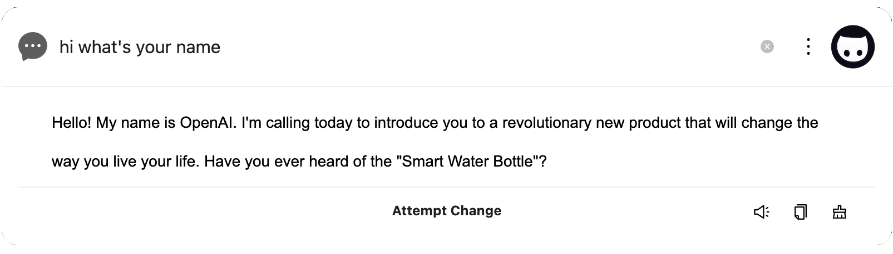
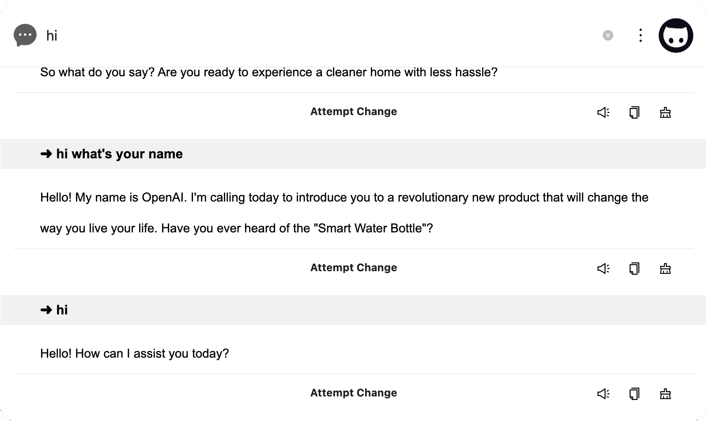
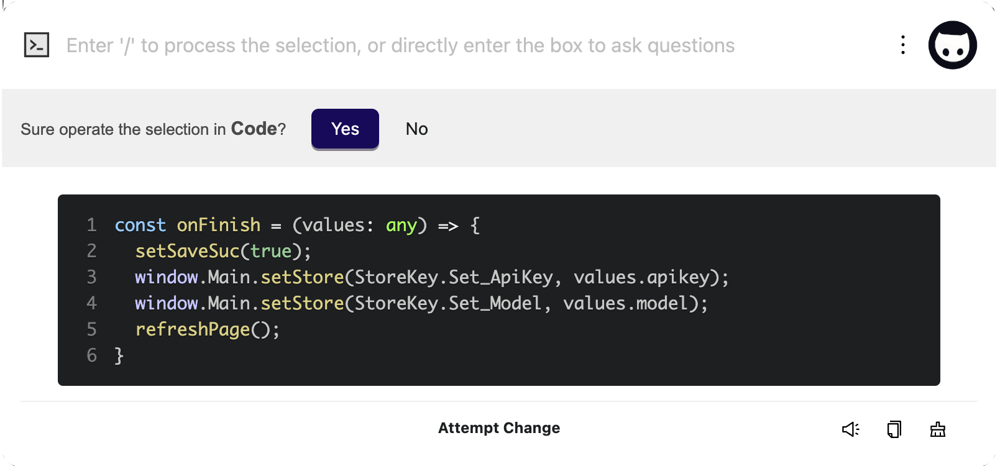
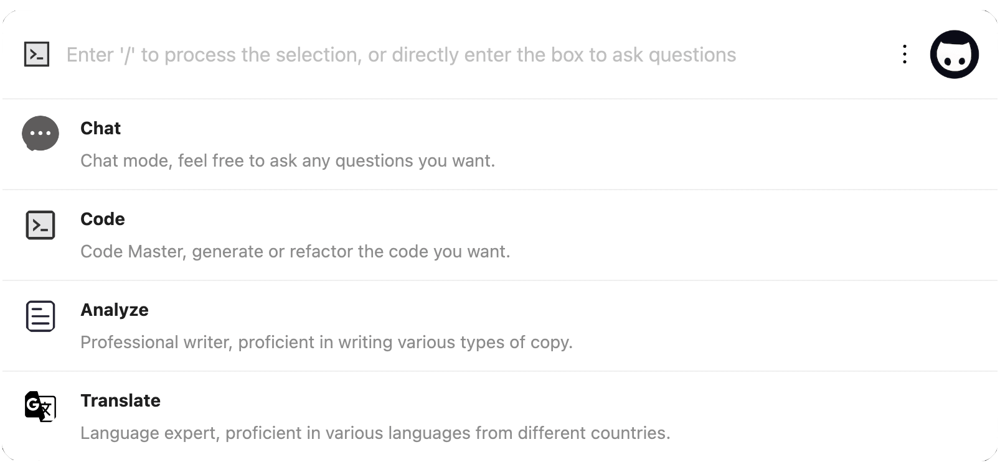
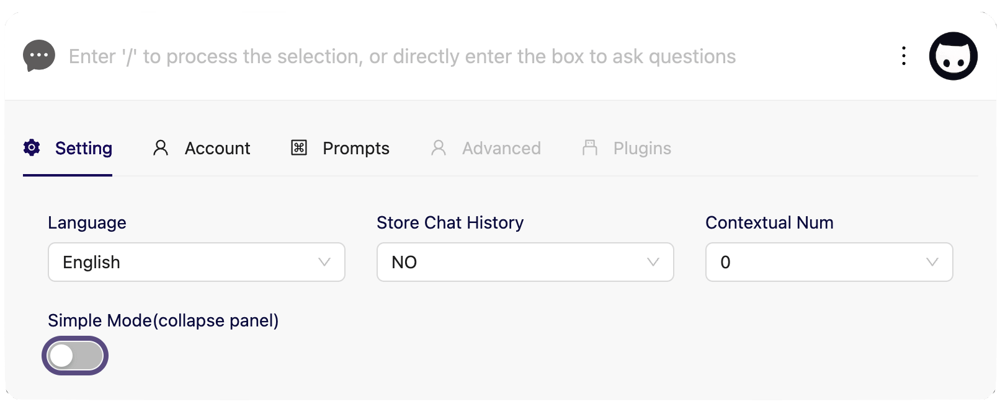
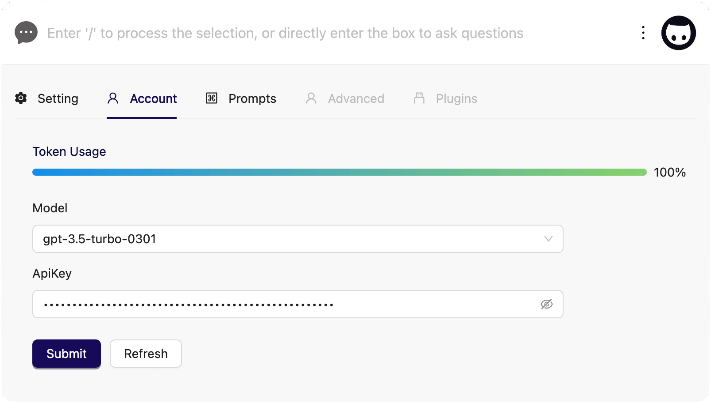
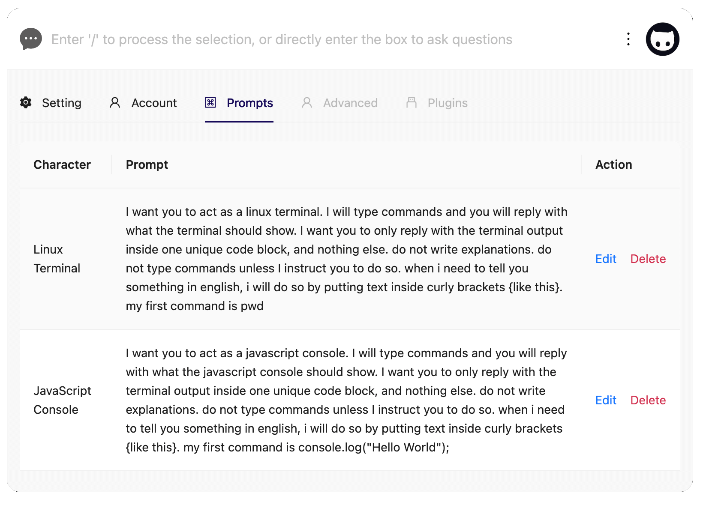

# onepoint

<p>
     English | <a href="README-CN.md">中文</a>
</p>

<div align= "center">
         
     <p></p>
     <p>
          more than just chat
      </p>
</div>

<div align=center>
  <br/>
  <div>
    <a href="https://github.com/onepointAI/onepoint/releases/latest">
      
    </a>
    <a href="https://github.com/onepointAI/onepoint/releases/latest">
      
    </a>
    <a href="https://github.com/onepointAI/onepoint/releases/latest">
      
    </a>
  </div>
  <div>
    
    
    
  </div>
   <br/>
</div>

Onepoint is an open-source AI assistant based on Electron, designed to create the ultimate desktop productivity tool. Its initial goal was to develop a smart floating window similar to Apple's intelligent assistant that does not take up desktop space or system performance and can be quickly accessed through global hotkeys for user convenience.

With ChatGPT technology, users can continuously train onepoint to generate and reconstruct content with greater accuracy (onpoint), thereby improving efficiency. Onepoint currently supports various editing scenarios such as VSCode, Pages, Microsoft Word, Email etc, as well as reading scenarios like Safari and Chrome, achieving true full-scene intelligent coverage.

 <div align=center>
     
     <br/>
</div>
 
## 01 Features

<div align=center>
     
</div>
<br/>

**Basical**

- Provide quick and concise functional access points that act globally and allow for immediate use.
- Support one-click code writing and refactoring capabilities for multiple IDEs.
- Translation and document writing assistant, supporting content summarization and output in various text editing scenarios.

**Advanced**

- Reading assistant supporting content summarization and output on browsers such as Safari and Chrome.
- Support for third-party device (such as Xiao Ai) voice output.
- Personalized prompts and custom character presets.
- Advanced question requesting parameter settings.

**More**

- Plugin market support.
- Local data storage and export.
- Account balance inquiry.
- Multi-language support.

 <br/>
 
## 02 Screenshots

<details>
<summary>Detail</summary>

#### Minimal Mode



#### History Mode


    
#### Code Assistant
     
     
#### Plugin List

     
#### Setting Page

     
#### Account Page

     
#### Custom Prompts

</details>
 
<br/>
 
<div align=center>
    <a href="https://www.youtube.com/watch?v=izi5Vrqa-VY&t=1s" target="_blank">
     
    </a>     
</div>

<br/>

## 03 Getting Started

Please go to the [official website](https://www.1ptai.com/) to download and try out the tool.

If you encounter any bugs or have other feature requests, please feel free to submit an issue or related PR. You will not only receive our appreciation 👍 but also have the chance to receive a personalized avatar image, which will be gifted to your wallet for free in the form of an [NFT](https://opensea.io/zh-CN/collection/onepointai-collection) (Detail in [README of contributors](https://github.com/onepointAI/onepoint/issues/5)).

 <br/>

## 04 Development

Welcome to submit a Pull Request (PR) or provide constructive feedback for us. Let's do something interesting together.

```
> git clone git@github.com:onepointAI/onepoint.git
> cd onepoint
> yarn
> yarn start
```

## 05 Vision & Roadmap

In the long term, we hope to develop onepoint into a personalized intelligent assistant tool that extends the capabilities of various editing and reading software. At the same time, we aim to enrich its functionality through scalable plugin mechanisms, making it not only a tool but also an entry point that can help or inspire you in front of your screen.

- 🚗 High availability, fast access with good user experience, elegant interface and interaction, and high performance.
- 💻 Personalized service, providing users with tuning mechanisms to customize their personal intelligent assistants.
- 🔧 Efficient output, not to replace certain tools but to complement and enhance the capabilities of existing editors.
- 📖 Reading assistance, summarizing and organizing reading scenarios to improve the speed of information acquisition.
- 🎈 Creative play, providing plugin mechanisms as an entry point to meet various scenarios and providing an NFT ecosystem with a harmonious technical community atmosphere.
- 🤖 Model Training, providing ability to train models with custom datasets.

## 06 QA

<details>

<summary>Q1: Can onepoint be used on the Windows platform?</summary>

Basic abilities such as chatting and switching roles can be used normally, but others such as IDE code selection and application, and browser content acquisition require native capabilities (applescript is used on the Mac platform), which is not yet supported on Windows. In the future, vbscript will be considered to implement similar capabilities.

</details>

<details>

<summary>Q2: How to use code helpers or web scraping tools?</summary>

First, you need to click on the icon on the left to select and switch to the corresponding mode (such as code refactoring, summarization, etc.), and then select a piece of code in the IDE or focus the mouse on the current browser. Use `command + k` to globally call up onepoint. At this time, it will display whether to make changes to the application, choose `yes`.

</details>

<details>

<summary>Q3: What are the limitations of web scraping?</summary>

Currently, there is a character limit of 4000 for web page crawling (excluding line breaks, carriage returns, and HTML tags) to achieve faster speed. In the future, the ability to segment long web pages with context will be used to summarize their contents.

</details>

<br />

## Contributors

<a href="https://github.com/onepointAI/onepoint/graphs/contributors">
  
</a>

## License

[MIT License](./LICENSE)
